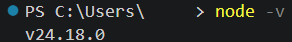

# 概要欄 — Remotion Agent Skills　日本語の指示だけで動画を作り、同じ型を量産する

Remotion（リモーション）と Claude Code を組み合わせて、コードを書かずに動画を作り、テロップを自動で乗せ、同じ型の動画を何本でも作れるようにする回です。

動画で使ったプロンプトは、**別ファイル「プロンプト集」**にまとめて配布しています。そちらをコピーしてお使いください。

---

## 🛠 準備の手順

> ⚠️ **パソコン（Windows / Mac / Linux）が必要です。** Remotion は自分のパソコンの中で動画を作る道具なので、**スマートフォンやタブレットでは使えません。** Mac をお使いの場合は、macOS 15（Sequoia）以降が対象です。

### ① Node.js が入っているか、まず確認する

Node.js（ノードジェイエス）は、Remotion を動かすための土台になるソフトです。これが入っていないと、③で使う `npx` というコマンドが使えません。

**ただ、すでに入っている方もいます。** 入れる前に、まず確認してください。

ターミナル（Windowsなら PowerShell かコマンドプロンプト、Mac なら「ターミナル」）を開いて、次を実行します。

```
node -v
```

- **`v24.18.0` のようにバージョンが表示された** → 入っています。**②は飛ばして、③に進んでください。**（Remotion は Node 16 以上が必要です。数字の頭が 16 以上なら大丈夫です）
- **「認識されていません」「command not found」と出た** → 入っていません。下の「② Node.js を入れる」に進んでください



### ② Node.js を入れる（①で入っていなかった方だけ）

1. 公式サイトのダウンロードページを開く → **https://nodejs.org/en/download**
2. ページ上部の選択欄が、**ご自分のパソコン（Windows / macOS）**と、**「LTS」と付いたバージョン**になっていることを確認します

   

   LTS は「長期サポート版」という意味で、安定して使えるバージョンです。Current（最新版）は新しい機能が入るかわりに不具合も出やすいので、こだわりがなければ LTS を選んでください。

3. **そのままページの一番下までスクロールして、緑色のボタンを押します**
   - **Windows** … `Windows インストーラー (.msi)`
   - **Mac** … `macOS インストーラー (.pkg)`

   

   > 💡 **この2つの画像の間に、黒い画面でコマンドがずらっと並んでいますが、気にしなくて大丈夫です。** あれは「別のやり方でも入れられますよ」という上級者向けの案内です。**緑のボタンだけ**見てください。

4. ダウンロードしたファイル（多くの場合「ダウンロード」フォルダに入ります）を開き、画面の指示どおりに「次へ」を押していけば完了です。**設定を変える必要はありません**
5. 途中で、**「このアプリがデバイスに変更を加えることを許可しますか？」**（Mac の場合はパスワードや Touch ID）を求められます。**「はい」を押してください。** これはパソコンの設定を変えてよいかを確認する画面です
6. 入ったか確認します。**ターミナルをいったん閉じて開き直してから**、もう一度 `node -v` を実行してください

> 💡 **ターミナルは必ず開き直してください。** インストール直後は、開いたままのターミナルに反映されていないことがあります。「入れたのにバージョンが出ない」というときは、たいていこれが原因です。

> 🤖 **Claude Code に手伝ってもらうこともできます（一部はご自分で操作が必要です）。**
> Computer Use（パソコンの画面を見て操作してもらう機能）や Claude in Chrome を使えば、公式サイトを開くところやインストーラーを進めるところまでは頼めます。
> ただし、**上の5番の「変更を加えることを許可しますか？」の画面だけは、必ずご自分で押してください。** この画面は、パソコンが安全のために他のソフトから操作できないように守っている部分なので、Claude 側からは押せません。**「途中まで任せて、許可のところだけ自分で押す」**という形になります。
> 迷ったときの使い方としては、**画面を撮って Claude に貼り、「この画面で次に何を押せばいいですか」と聞く**のがおすすめです。操作を任せるより確実で、何をしているか分かったまま進められます。

### ③ Remotion のプロジェクトを作る

**Remotion は、パソコンにアプリとして入るタイプのソフトではありません。** デスクトップにアイコンができるわけでも、アプリ一覧に出てくるわけでもありません。**フォルダが1つ作られ、その中に道具一式が入る**、という形で導入します。

そのため、**「Remotion を起動する」のではなく、このフォルダの中で作業する**ことになります。逆に言えば、フォルダごと削除すればきれいに消え、パソコンの他の場所には何も残りません。

やり方は2つあります。**どちらでも同じものが出来上がります。**

---

#### 【A】Claude Code に頼む（かんたん・おすすめ）

**Remotion 公式が、AIに渡すためのプロンプトを用意してくれています。** 公式サイト（https://www.remotion.dev/docs/ ）でも、コマンドの手順より先に案内されている方法です。

Claude Code を開いて、**プロンプト集の P1** を貼り付けてください。**動画の実演でもこれを使っています。** あとは Claude Code が順番にコマンドを実行してくれます。途中で「このコマンドを実行していいですか」と許可を聞かれるので、内容を見て進めてください。

> ⚠️ **作る場所は、P1 の中でご自分で指定してください。** 指定しないと、Claude Code を起動しているフォルダの中に作られます。
> **①②の Node.js だけは、この方法では入れられません。** 公式のプロンプトも「Node.js が入っていること」を前提にしています。先に①②を済ませてください。

**終わったら、Claude Code で `/reload-skills` を実行してください。**（詳しくは下の「④」）

うまくいかないときや、何が起きているか知りたいときは、下の【B】を見てください。**同じことを手で1つずつやっているだけです。**

---

#### 【B】自分でコマンドを打つ

ターミナルで、上から順に実行します。

1. Agent Skills（Claude Code に Remotion の書き方を渡す仕組み）を入れる

   ```
   npx -y skills@latest add remotion-dev/skills -g -y
   ```

   **【A】の P1 と同じコマンドです。** `-g` を付けてパソコン全体に入れておくと、あとから作るプロジェクトでも入れ直さずに使えます。**Remotion 公式ドキュメント（https://www.remotion.dev/docs/ai/claude-code ）ではプロジェクトごとに `npx remotion skills add` を実行する案内になっていますが、動画では `-g` の方法で検証しており、以降の手順もこちらに揃えています。**

2. プロジェクトを作る

   ```
   npx create-video@latest --yes --blank my-video
   ```

   `my-video` の部分は好きなフォルダ名にできます。

3. 作られたフォルダに移動して、必要なものを取り込む

   ```
   cd my-video
   npm i
   ```

   **この `npm i` が、Remotion 本体をネットから取ってくる作業です。** 取ってきたものは、このフォルダの中の `node_modules` という場所に入ります。時間がかかりますが、必要な処理なので終わるまで待ってください。

4. 書き出し用のブラウザを、先に取ってきておく

   ```
   npx remotion browser ensure
   ```

   Remotion は動画を書き出すとき、**内部でブラウザを使って1コマずつ画面を描いて記録しています。** その専用ブラウザは、何もしないと**初めて書き出すときにダウンロードが始まります。** 回線によっては待たされるので、**ここで先に取ってきておくと、初回からそのまま書き出せます。**

5. プレビュー画面（Remotion Studio）を開く

   ```
   npm run dev
   ```

   ブラウザが開いて、動画をその場で再生できる画面が出れば準備完了です。

---

> ⚠️ **【A】【B】どちらの場合も、プロジェクトは OneDrive や iCloud などの同期フォルダの外に作ってください。**（例：`C:\dev\`）
> 同期フォルダの中に作ると、取り込むファイルの数が非常に多いため同期が止まらなくなったり、日本語を含むフォルダ名で不具合が出たりすることがあります。

> 💡 **動画の中でも【A】でやっています。** 見たとおりに真似していただければ大丈夫です。**【B】は、うまくいかなかったときに「いま何をしているところなのか」を確かめるための参考**として載せています。

---

### ④ Claude Code に「スキルを読み直して」と伝える（必須）

**③が終わったら、必ずこれをやってください。** Claude Code で、次のように打ちます。

```
/reload-skills
```

`Reloaded skills: ○○ skills available (11 added)` のように、追加された数が表示されれば成功です。

**なぜ必要かというと、Claude Code は起動したときに「いま使えるスキル」を読み込んでいるからです。** ③であとから足した Remotion の説明書には、そのままでは気づいてくれません。「もう一度読み直して」と伝えるのが、このコマンドです。

> ⚠️ **これをやらないと、`/remotion-create` のような `/` で始まるコマンドが出てきません。**
> 「スキルの一覧を出しても何も出てこない」というときは、**入れ直す前に、まずこれを試してください。** 入れ直しても、読み直さなければ同じ結果になります。

---

あとは、出来上がったフォルダの中で Claude Code を起動して、プロンプト集のプロンプトを貼り付けていくだけです。

---

## 📖 用語のかんたん解説

| 用語 | ざっくり言うと |
|---|---|
| **Remotion** | コードで動画を作る道具。手で編集するのではなく、動画を「組み立てる」 |
| **React** | もともとはWebサイトの画面を作るための技術。Remotion はこれを使って動画を作る |
| **コンポーネント** | 画面の「部品」。部品を組み合わせて画面（＝動画の1コマ）を作る |
| **レンダリング** | コードから、実際に見える動画ファイル（MP4など）を書き出す処理。動画では「書き出し」と呼んでいます |
| **fps** | 1秒あたりのコマ数。30fpsなら1秒＝30コマ |
| **Node.js** | パソコンでこうしたツールを動かすための土台。Remotion に必要 |
| **LTS** | 長期サポート版。安定して使えるバージョンのこと |
| **ターミナル** | パソコンに文字でコマンドを打って指示する画面。Windowsなら PowerShell／コマンドプロンプト、Macなら「ターミナル」 |
| **npx** | Node.js に付いてくるコマンド。「ネットから必要なものを取ってきて実行する」くらいの意味 |
| **npm i** | プロジェクトに必要な部品をネットから取ってくるコマンド。Remotion 本体もこれで入る |
| **node_modules** | 取ってきた部品が入るフォルダ。ファイル数が非常に多いので、同期フォルダの中に置くと問題が出やすい |
| **Agent Skills** | AIに、ある道具の使い方をまとめた資料を渡しておく仕組み。今回は Remotion 公式の資料を Claude Code に渡している |
| **`/reload-skills`** | Claude Code に「スキルを読み直して」と伝えるコマンド。**あとから足したスキルは、これを打つまで使えない** |
| **MCP** | AIを外部のサービスに直接つなぐための共通規格。**今回は使いません**（Agent Skills との違いは下記） |
| **プランモード** | Claude Code の機能。ファイルを書き換える前に「こう作ります」という計画を出して、承認を待ってくれる |
| **Computer Use** | Claude にパソコンの画面を見せて、代わりに操作してもらう機能。ただしパソコンの許可を求める画面は操作できない |
| **Claude in Chrome** | Claude に Chrome（ブラウザ）を操作してもらう機能 |
| **Remotion Studio** | ブラウザで動画をその場で再生して確認できる画面 |
| **useCurrentFrame** | 「今、動画の何コマ目か」を取り出す、Remotion の中心になる仕組み |
| **AbsoluteFill** | 画面いっぱいに要素を重ねて置く部品。動画の上にテロップを乗せるときに使う（編集ソフトのレイヤーに近い） |

**MCP と Agent Skills の違い**：MCP は「AIに外のサービスを**操作させる**仕組み」、Agent Skills は「AIに**書き方のルールを渡す**仕組み」です。今回 AI にやってほしいのは正しいコードを書くことだけで、外のサービスにつなぐ必要がないため、Agent Skills を使っています。

---

## 💰 ライセンスと料金

**Remotion は完全に無料ではありません。** 使う人数と立場で変わります。

| 立場 | 費用 |
|---|---|
| 個人（学習・副業・個人開発） | **無料**。商用利用もできます |
| 3人以下の会社 | **無料** |
| 4人以上の営利企業 | **有料**（1人あたり月$25〜） |

> ⚠️ **公式の条件では、「Claude Code のようなAIツールに書かせる人」も人数に数えられます。**
> 「自分はコードを書いていないから対象外」とはなりません。4人以上の会社で業務に使う前に、必ず下の公式ページで最新の条件をご確認ください。

---

## 📁 動画で使った素材（ダウンロード）

動画の後半、**すでにある動画にテロップを乗せる**ところで使っている2つのファイルです。同じものを手元で試せます。

https://drive.google.com/drive/folders/1sygb72CEeWTAcBVNRngiWVdQLpI3N9fe?usp=sharing

- `source.mp4` … テロップを乗せる元の動画（15秒・無音）
- `subtitles.txt` … テロップのリスト。**時間の行と文字の行が交互**に並んだテキストです

ご自分の動画とテキストで試していただいてもかまいません。その場合は、プロンプト集P8のファイル名をご自分のものに置き換えてください。

---

## 🔗 リンク

- Remotion 公式サイト：https://www.remotion.dev/
- プロジェクトの作り方（公式ドキュメント）：https://www.remotion.dev/docs/
- Agent Skills（公式ドキュメント）：https://www.remotion.dev/docs/ai/skills
- Claude Code で使う手順（公式ドキュメント）：https://www.remotion.dev/docs/ai/claude-code
- ライセンスと料金（公式ドキュメント）：https://www.remotion.dev/docs/license
- ライセンスのよくある質問（公式ドキュメント）：https://www.remotion.dev/docs/license/faq
- Node.js（ダウンロード）：https://nodejs.org/
- 動画で紹介した導入事例（GMO / One Tech Blog、※元記事が現在メンテナンス中のためWeb Archiveのアーカイブを掲載）：http://web.archive.org/web/20260608044102/https://tech.gmogshd.com/remotion-video-automation/

---

## ⚠️ 試すときの注意点

- **書き出しには時間がかかります。** 最初は尺を短く、画質も控えめに。とくにテロップ入れは元の動画を読み込むぶん重くなるので、素材は短く低画質のものから始めてください。
- **量産は少ない本数から。** 本数を増やすほど書き出し時間が延び、動画ファイルでパソコンの容量を使います。まず数本で試してから増やしてください。
- **一発で思いどおりにならないこともあります。** 指示の出し方を変えながら、少しずつ直していくものだと考えてください。エラーが出たら、その文章をそのまま Claude Code に貼って相談できます（プロンプト集のP7・P15）。
