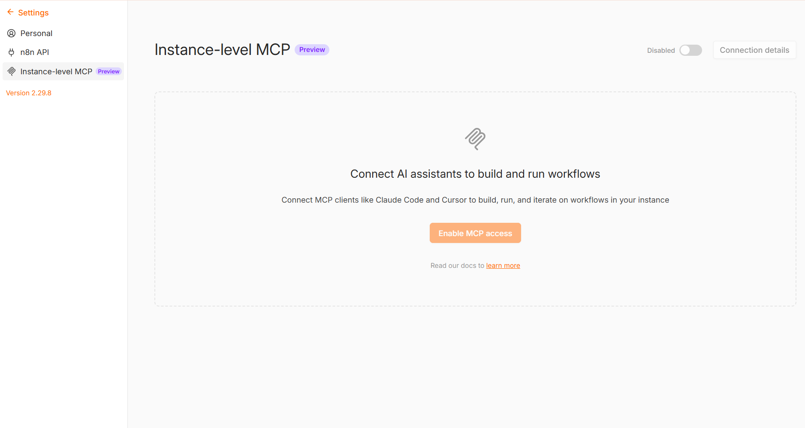
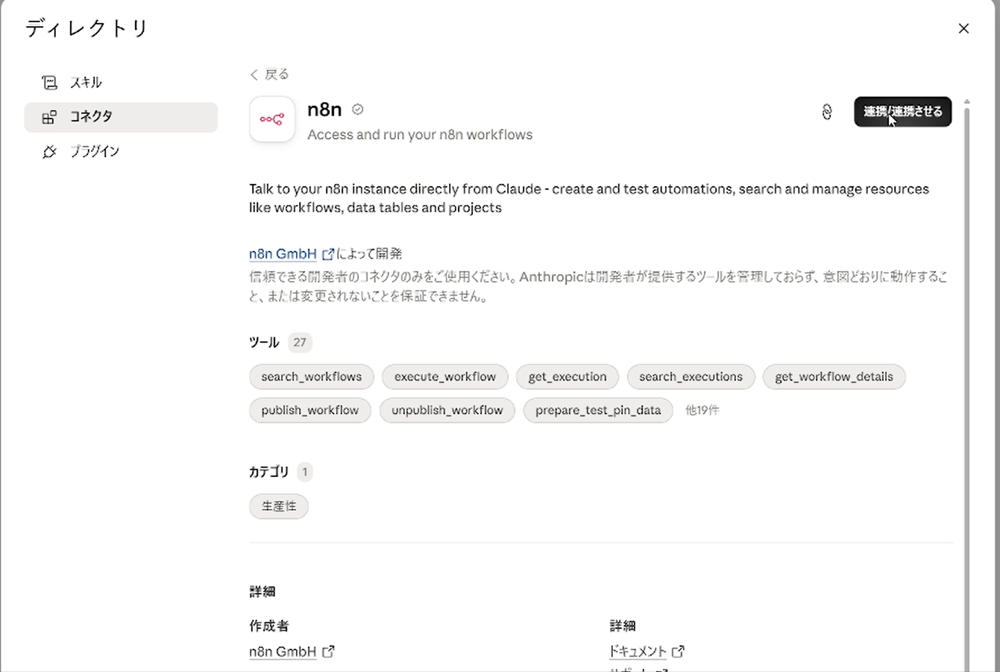
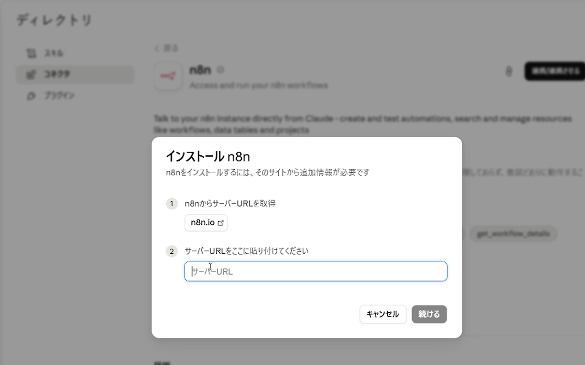
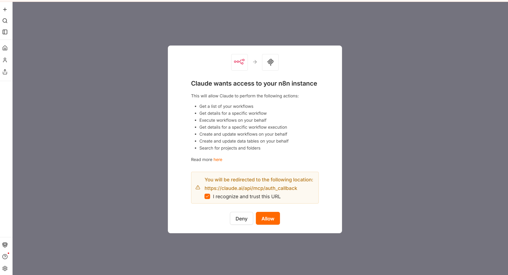

# 概要欄 — n8n MCP　自然言語でワークフローを自動生成しよう

この動画では、n8n の MCP機能を Claude Code につないで、**日本語で話しかけるだけで n8n のワークフローを作ったり、テスト実行したり、直したりする**方法を紹介しています。

---

## 📌 この動画の前提

- **n8n のアカウントは作成済みであること。** n8n 自体の登録・基本操作は「モジュール6：業務が自走する仕組みを作る（AIエージェント編）」で解説しています → https://ai-plus.share-wis.com/courses/48605
- **Claude Code が使えること。**（インストール・ログイン済み）

---

## 🔌 n8n MCP を Claude Code（デスクトップ版）につなぐ手順

### ① n8n側で MCP を有効にして、サーバーURLをコピーする

1. n8n を開く → **Settings（設定）** → **Instance-level MCP**
2. 画面**右上の「Disabled」の横にあるスイッチ（トグル）をオン**にする
   - ※有効化には、そのn8nの**オーナーまたは管理者権限**が必要です（自分で作ったn8nなら通常オーナーです）
3. 右上の **「Connection details（接続情報）」** を開き、**サーバーURL**をコピーしておく



### ② Claude Code で n8n コネクタを連携する

1. Claude Code で **`/mcp`** と打つ
2. 開いた画面（ディレクトリ → コネクタ）で **「n8n」と検索**して開き、右上の **「連携/連携させる」をクリック**



3. 「サーバーURLをここに貼り付けてください」に、**①でコピーしたサーバーURLを貼り付けて「続ける」**



4. n8n の画面に切り替わるので、内容を確認して **「Allow（許可）」** を押す



> ⚠️ **Claude Code をチームプラン／エンタープライズプランで使っている場合**、コネクタの連携はその場では完了しません。**連携リクエストが組織の管理者に送られ、管理者が承認してはじめて使えるようになります。** 承認されるまでは接続できないため、会社のアカウントで試す方は先に管理者へ依頼しておいてください。

### ③ つながったか確認する

Claude Code に次のように聞いて、ツールが一覧で出れば接続成功です：

```
n8nのMCPで使えるツールを一覧してください。
```

### ④ 既存のワークフローをAIに触らせたい場合

すでにある個々のワークフローをAIから操作するには、そのワークフローを有効化する必要があります：
- Settings → **Instance-level MCP → 「Workflows」タブ → 「Enable workflows」** から、対象のワークフローを有効にする
- （ワークフローの編集画面の Settings にある「Available in MCP」トグルからでも有効化できます）

---

## 📖 用語のかんたん解説

| 用語 | ざっくり言うと |
|---|---|
| **MCP** | AIを外部のツールとつなぐための共通規格。今回はこれで Claude と n8n をつなぐ |
| **ノード** | n8n の処理1ブロック（「Gmailを読む」「Slackに送る」など）。動画では「ブロック」と呼んでいます |
| **ワークフロー** | ノードを線でつないだ処理の流れ全体 |
| **トリガー** | ワークフローの起点。「何が起きたら動くか」（例：フォーム受信、毎朝9時） |
| **Webhook** | 外部からデータを受け取る"受け口"。今回はフォーム送信を受け取る入口として使用 |
| **インスタンス** | "自分専用の n8n" のこと |
| **テスト実行** | ワークフローを本番稼働させずに、試しに1回動かして動作を確かめること |

---

## 🔗 リンク

- n8n 公式サイト：https://n8n.io
- n8n MCP サーバー ドキュメント：https://docs.n8n.io/connect/connect-to-n8n-mcp-server
- モジュール6：業務が自走する仕組みを作る（AIエージェント編）：https://ai-plus.share-wis.com/courses/48605

---

## ➕ 追加情報：もう一つの n8n MCP

動画で使っているのは n8n に内蔵されている MCP ですが、有志が開発した **n8n-mcp** というツールもあります。n8n の2,000種類以上のノードの仕様やテンプレート集をAIに参照させられるのが特長で、こちらを使う方法もあります。興味のある方は使ってみてください。

- n8n-mcp（GitHub）：https://github.com/czlonkowski/n8n-mcp

---

## ⚠️ 試すときの注意点

- **いきなり本番のワークフローを AI に編集させない。** まずはテスト用として、**ワークフローを「非アクティブ（Inactive）」＝オフの状態**で作りましょう。n8n のワークフロー編集画面の右上に **Active / Inactive の切り替えスイッチ**があり、ここがオフの間は、トリガー（フォーム受信など）が来ても**自動では動きません**（手動のテスト実行はできます）。オンにすると本番稼働が始まり、意図しないタイミングで通知が飛ぶことがあります。
- **Google や Slack との連携（ログイン設定）だけは、自分で n8n の画面から登録が必要です。** ここは AI に代わってもらえません。
- **一回のお願いで毎回完璧にはなりません。** 「土台を AI に作ってもらって、細かいところは会話で直す」——この使い方だとラクに進められます。うまくいかないときは、症状をそのまま Claude に伝えて直してもらいましょう。
